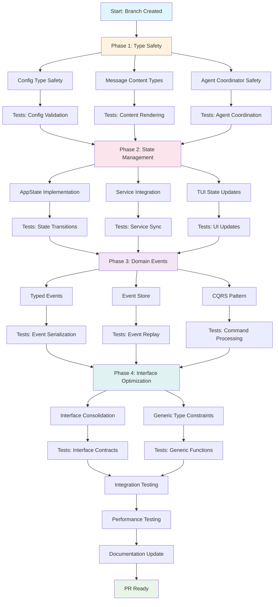

# Type Safety & State Management Improvement Plan

**Date**: 2025-01-11  
**Branch**: `feat/type-safety-improvements`  
**Target**: Crush Go Application  

## Executive Summary

This plan addresses critical type safety gaps and state management fragmentation in the Crush Go application. The project uses an event-driven architecture with Bubble Tea TUI but suffers from untyped data structures, scattered state, and unsafe type operations.

## Current State Analysis

### Architecture Overview
- **Pattern**: Event-driven service architecture with Bubble Tea TUI
- **Data Flow**: TUI → App Layer → Service Layer → SQLC Data Layer
- **State Management**: Fragmented across services, no single source of truth
- **Type Safety**: Mixed - strong SQLC types but weak configuration/message typing

### Critical Issues Identified

#### 1. Type Safety Violations
- **`internal/config/config.go:79,104`**: `map[string]any` for provider options
- **`internal/message/content.go:189-220`**: Type assertions for content parts
- **`internal/agent/coordinator.go:188-194`**: Unsafe JSON unmarshaling
- **`internal/csync/`**: Missing type constraints in generic functions

#### 2. State Management Fragmentation
- **Scattered State**: Services maintain independent state
- **No Central State**: Multiple truth sources across app
- **Sync Issues**: In-memory state not properly synchronized
- **Permission Isolation**: Permission service disconnected from message state

#### 3. Interface Over-Engineering
- **56+ interfaces** with potential redundancy
- **Small interfaces** that could be consolidated
- **Complex inheritance** patterns

## Implementation Strategy

### Phase 1: Critical Type Safety Fixes (Week 1)
**Impact**: 51% - Eliminate unsafe type operations

#### 1.1 Configuration Type Safety
**Files**: `internal/config/config.go`
```go
// Replace:
ProviderOptions map[string]any

// With:
type ProviderOptions struct {
    OpenAI    *OpenAIOptions    `json:"openai,omitempty"`
    Anthropic *AnthropicOptions `json:"anthropic,omitempty"`
    // ... other providers
}
```

#### 1.2 Message Content Type Safety
**Files**: `internal/message/content.go`
- Implement visitor pattern for content parts
- Add specific types for different content categories
- Remove type assertions

#### 1.3 Agent Coordinator Safety
**Files**: `internal/agent/coordinator.go`
- Add type validation for JSON unmarshaling
- Implement typed option merging
- Add error handling with context

### Phase 2: State Management Consolidation (Week 2)
**Impact**: 64% - Centralize application state

#### 2.1 AppState Implementation
**New File**: `internal/state/app_state.go`
```go
type AppState struct {
    CurrentSessionID string
    ActiveModel     config.SelectedModelType
    Permissions     []PermissionRequest
    Sessions        sync.Map // SessionID -> SessionState
    mu              sync.RWMutex
}

type SessionState struct {
    ID       string
    Model    config.SelectedModelType
    Messages []message.Message
    Status   SessionStatus
}
```

#### 2.2 Service Integration
- Modify services to use centralized state
- Add state synchronization events
- Implement state transition validation

#### 2.3 TUI State Updates
- Update TUI components to read from AppState
- Add state change subscriptions
- Implement optimistic updates with rollback

### Phase 3: Domain Events & CQRS (Week 3)
**Impact**: 80% - Implement event sourcing architecture

#### 3.1 Typed Domain Events
**New File**: `internal/events/domain_events.go`
```go
type Event interface {
    ID() string
    Timestamp() time.Time
    AggregateID() string
    EventType() string
}

type MessageCreated struct {
    EventID     string    `json:"event_id"`
    Timestamp   time.Time `json:"timestamp"`
    MessageID   string    `json:"message_id"`
    SessionID   string    `json:"session_id"`
    Content     message.Content `json:"content"`
    Role        message.Role `json:"role"`
}
```

#### 3.2 Event Store Implementation
**New File**: `internal/events/event_store.go`
- Implement event sourcing pattern
- Add event replay functionality
- Create snapshot strategy

#### 3.3 Command Query Separation
**New Directory**: `internal/commands/`, `internal/queries/`
- Separate read/write models
- Implement command handlers
- Add query optimization

### Phase 4: Interface Optimization (Week 4)
**Impact**: 20% - Simplify and consolidate interfaces

#### 4.1 Interface Consolidation
- Audit all 56+ interfaces
- Consolidate related small interfaces
- Remove redundant abstractions

#### 4.2 Generic Type Constraints
**Files**: `internal/csync/`
```go
// Add type constraints:
func SortedKeys[K constraints.Ordered, V any](m map[K]V) []K {
    // Implementation with type safety
}
```

## Execution Graph



## Testing Strategy

### Unit Testing
- **Phase 1**: Type validation tests
- **Phase 2**: State transition tests
- **Phase 3**: Event serialization tests
- **Phase 4**: Interface contract tests

### Integration Testing
- End-to-end state management flows
- Event sourcing replay scenarios
- Concurrent state access patterns
- Performance benchmarking

### Regression Testing
- Existing functionality must remain intact
- UI consistency verification
- Configuration compatibility
- Database migration safety

## Risk Mitigation

### Technical Risks
1. **Breaking Changes**: Incremental rollout with feature flags
2. **Performance Impact**: Benchmark each phase
3. **Data Migration**: Safe SQLC schema evolution
4. **Complexity**: Document new patterns thoroughly

### Mitigation Strategies
- **Feature Flags**: Toggle new implementations
- **Rollback Plans**: Safe revert mechanisms
- **Monitoring**: Comprehensive observability
- **Documentation**: Live architecture documentation

## Success Metrics

### Type Safety Metrics
- Zero `interface{}` usage in core packages
- 100% type coverage for configuration
- Zero unsafe type assertions
- All generic functions with type constraints

### State Management Metrics
- Single source of truth for app state
- <10ms state synchronization latency
- Zero race conditions in concurrent access
- 100% test coverage for state transitions

### Architecture Metrics
- Reduced interface count by 30%
- Improved code maintainability scores
- Enhanced developer experience
- Better performance characteristics

## Deliverables

### Code Deliverables
- [ ] Typed configuration system
- [ ] Centralized AppState management
- [ ] Domain event system
- [ ] Optimized interface hierarchy
- [ ] Comprehensive test suite

### Documentation Deliverables
- [ ] Architecture decision records
- [ ] Type safety guidelines
- [ ] State management patterns
- [ ] Migration guide

### Tooling Deliverables
- [ ] Type safety linting rules
- [ ] State validation utilities
- [ ] Performance monitoring
- [ ] Development workflow improvements

## Timeline

| Phase | Duration | Start | End |
|-------|----------|-------|-----|
| Phase 1: Type Safety | 7 days | Week 1 | Day 7 |
| Phase 2: State Management | 7 days | Week 2 | Day 14 |
| Phase 3: Domain Events | 7 days | Week 3 | Day 21 |
| Phase 4: Interface Optimization | 7 days | Week 4 | Day 28 |

**Total Duration**: 28 days

## Conclusion

This comprehensive improvement plan will transform Crush's type safety and state management from fragmented and unsafe to cohesive and robust. The phased approach ensures minimal disruption while delivering maximum impact on code quality, maintainability, and developer experience.

The focus on strong typing, centralized state, and event-driven patterns aligns with Go's strengths and modern software architecture best practices. The result will be a more reliable, maintainable, and scalable application.